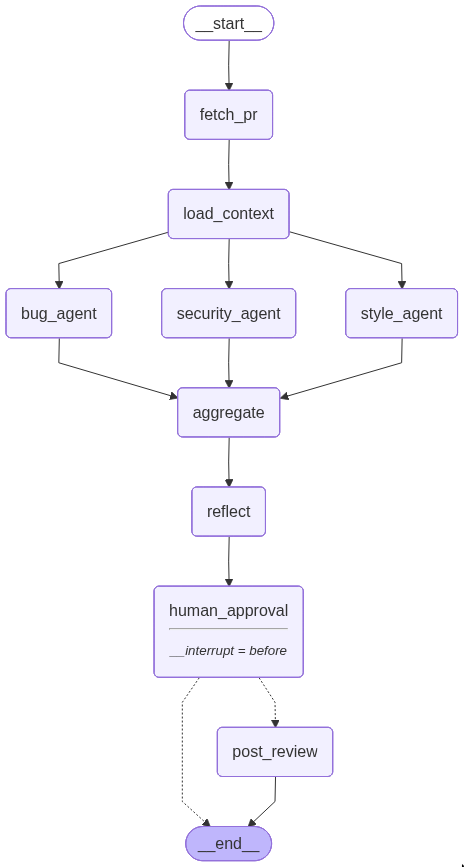

# Code Review Agent

LangGraph-powered agent that autonomously reviews GitHub PRs for bugs, security vulnerabilities, and code quality with human-in-the-loop approval before posting.


## Architecture



**Key design decisions:**
- Three analysis agents run **in parallel** reducing total latency by ~3x
- `reflect` node acts as a meta-reviewer, catching duplicates and mis-rated findings before a human sees them
- Graph **interrupts** at `human_approval` step. Nothing is posted to GitHub without explicit consent
- State is **checkpointed to SQLite**. If posting fails, re-run resumes from the checkpoint (no re-running expensive LLM calls)

## Features
- **Parallel LLM analysis** : bug, security, and code quality agents run concurrently
- **Human-in-the-loop** : graph pauses for approval; approve, reject, or provide feedback
- **Resumable runs** : SQLite checkpointing persists state across process restarts
- **Configurable severity** : filter findings by `critical`, `major`, or `minor`
- **Streaming CLI** : real-time per-node progress as each step completes
- **Token tracking** : input/output token counts per node, printed at end of run
- **Retry on failure** : if GitHub posting fails, fix your token and retry without re-analysis
- **Dry-run by default** : review findings locally before enabling GitHub posting

## Demo

```
$ uv run code-review-agent https://github.com/owner/repo/pull/42

Reviewing: https://github.com/owner/repo/pull/42
Model: claude-sonnet-4-6

  → Fetching PR metadata & diff............ ✓
  → Loading file context................... ✓
  → Analysing for bugs..................... ✓
  → Analysing for security issues.......... ✓
  → Analysing for code quality............. ✓
  → Aggregating findings................... ✓
  → Reviewing & deduplicating.............. ✓

Found 3 finding(s):

[1/3]   🔴 CRITICAL  🔒 security  src/api/auth.py:47
     SQL query constructed via string concatenation with user input
     Suggestion:
       Use parameterized queries: cursor.execute("SELECT * FROM users
       WHERE id = ?", (user_id,))

[2/3]   🟠 MAJOR  🐛 bug  src/utils/parser.py:112
     IndexError when input list is empty — no bounds check before access
     Suggestion:
       Add guard: if not items: return None

[3/3]   🟡 MINOR  ✨ style  src/api/auth.py:23
     Function handles authentication, authorization, and logging — too
     many responsibilities
     Suggestion:
       Extract logging into a decorator and authorization into a
       separate middleware

Approve posting this review?
  [y] Yes, post to GitHub
  [n] No, discard
  [f] No, but provide feedback

> n

Review discarded.

Token Usage
  bug_agent               in= 2,847  out=   312
  reflect                 in= 1,203  out=   287
  security_agent          in= 2,891  out=   445
  style_agent             in= 2,856  out=   198
  ──────────────────────────────────────────────
  TOTAL                   in= 9,797  out= 1,242
```

## Quick Start

```bash
# Clone and install
git clone https://github.com/sandaruwan98/code-review-agent-langgraph.git
cd code-review-agent-langgraph
cp .env.example .env   # add your API keys
uv sync

# Review a PR (dry-run by default)
uv run code-review-agent https://github.com/owner/repo/pull/123

# Post review to GitHub
uv run code-review-agent https://github.com/owner/repo/pull/123 --post

# Only show critical + major findings
uv run code-review-agent https://github.com/owner/repo/pull/123 --min-severity major
```

## Configuration

| Variable | Required | Default | Description |
|---|---|---|---|
| `ANTHROPIC_API_KEY` | Yes | - | Anthropic API key |
| `GITHUB_TOKEN` | Yes | - | GitHub token (needs `repo` scope for posting) |
| `MODEL_NAME` | No | `claude-sonnet-4-6` | LLM model to use |
| `MODEL_BASE_URL` | No | `https://api.anthropic.com` | LLM API endpoint |
| `MIN_SEVERITY` | No | `minor` | Minimum severity: `critical`, `major`, `minor` |
| `POST_TO_GITHUB` | No | `false` | Set `true` to post reviews to GitHub |

## Project Structure

```
src/code_review_agent/
├── graph.py              # StateGraph assembly - nodes, edges, checkpointing
├── state.py              # ReviewState TypedDict - shared state schema
├── config.py             # pydantic-settings - reads .env
├── cli.py                # CLI entry point - streaming, approval, retry
└── nodes/
    ├── fetch_pr.py       # GitHub API - diff, metadata, changed files
    ├── load_context.py   # GitHub API - full file content (50KB limit)
    ├── bug_agent.py      # LLM - logic errors, null derefs, race conditions
    ├── security_agent.py # LLM - injections, XSS, hardcoded secrets
    ├── style_agent.py    # LLM - code quality + test coverage gaps
    ├── aggregate.py      # Merge parallel findings, filter by severity
    ├── reflect.py        # LLM - deduplicate, re-rate, improve suggestions
    ├── post_review.py    # Post to GitHub PR or dry-run
    └── _utils.py         # Robust JSON parsing for LLM output
```

## How It Works

The agent is built as a **LangGraph StateGraph**, a directed graph where each node is a function that reads from and writes to a shared `ReviewState`.

1. **Fetch & Context** : `fetch_pr` pulls the PR diff and metadata from the GitHub API. `load_context` fetches full file contents (capped at 50KB per file) so the analysis agents have more than just diff hunks to work with.

2. **Parallel Analysis** : Three LLM-powered agents run concurrently via LangGraph's fan-out edges. Each agent has a focused system prompt (bugs, security, or code quality) and returns structured `ReviewComment` objects. The `findings` state field uses an `operator.add` reducer so all three agents can write to it safely in parallel.

3. **Aggregate & Reflect** : `aggregate` merges the three result sets and filters by the configured minimum severity. `reflect` then runs a second LLM pass to remove duplicates, correct mis-rated severities, and ensure every finding has an actionable suggestion.

4. **Human-in-the-Loop** : The graph interrupts before `human_approval`, pausing execution. The CLI displays the findings and prompts the user. On approval, the graph resumes to `post_review`; on rejection, it routes to `END`.

5. **Checkpointing** : State is persisted to SQLite after each node. If the process exits (or posting fails), re-running the same PR URL resumes from the last checkpoint. So the expensive LLM analysis is not repeated.

## Tech Stack

- **Python 3.12** with [uv](https://docs.astral.sh/uv/) for package management
- **[LangGraph](https://langchain-ai.github.io/langgraph/)** : state machine orchestration, parallel execution, checkpointing
- **[LangChain](https://python.langchain.com/)** : LLM abstraction layer
- **[Claude](https://docs.anthropic.com/)** (Anthropic) : LLM for code analysis
- **httpx** : GitHub REST API client
- **pydantic-settings** : typed configuration from `.env`
- **SQLite** : checkpoint persistence (zero infrastructure)
